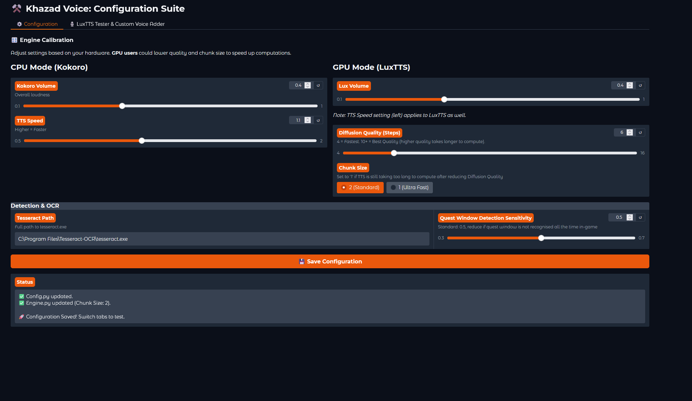
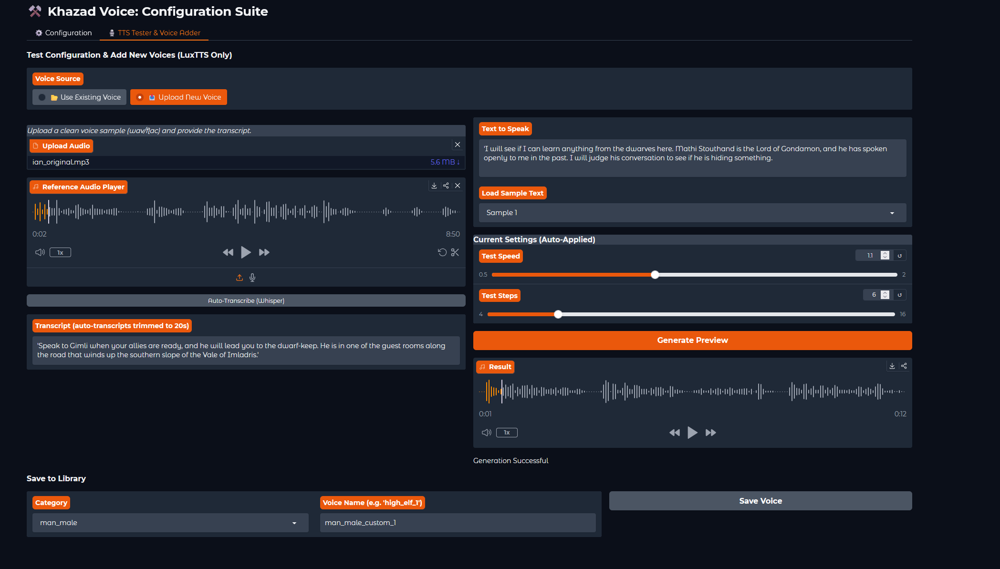

# ⚒️ Khazad Voice TTS
**Immersive AI Narrator for The Lord of the Rings Online**

**Khazad Voice TTS** is an external utility designed to provide real-time narration for *The Lord of the Rings Online* (LOTRO). By combining Optical Character Recognition (OCR) with advanced Text-to-Speech (TTS) models, this tool captures quest text from your screen and narrates it aloud using context-aware AI voices.

<div align="center">
  <table style="border: none;">
    <tr>
      <td align="center" style="border: none;">
        <strong>GPU Model (LuxTTS)</strong><br>
        <a href="https://www.youtube.com/watch?v=LlAibQ_TlY4">
          
        </a>
      </td>
      <td align="center" style="border: none;">
        <strong>CPU Model (Kokoro82M)</strong><br>
        <a href="https://www.youtube.com/watch?v=aR_5aRTrMQg">
          
        </a>
      </td>
    </tr>
  </table>
</div>

## Table of Contents

* [Key Features](#key-features)
* [Prerequisites](#prerequisites)
   * [1. Tesseract OCR](#1-tesseract-ocr)
   * [2. getNPCNames Plugin (Retail Only)](#2-getnpcnames-plugin-retail-mode-only)
* [Installation](#installation)
* [Configuration & Performance Test](#-configuration--performance-test)
* [Calibration (Important)](#calibration-important)
   * [Retail LOTRO](#-retail-lotro)
   * [Echoes of Angmar](#-echoes-of-angmar)
* [Usage & Modes](#usage--modes)
   * [1. Retail (Live Servers)](#1-retail-live-servers)
   * [2. Echoes of Angmar (Classic)](#2-echoes-of-angmar-classic-mode)
* [🧪 TTS Tester & Custom Voices](#-tts-tester--custom-voices)
* [FAQ & Troubleshooting](#faq--troubleshooting)
* [Future Roadmap](#future-roadmap)
* [Credits](#credits)

---

## Key Features

* **Dual AI Engines:**
    * **CPU Mode (Kokoro):** A lightweight, fast inference model compatible with most standard CPUs.
    * **GPU Mode (LuxTTS):** A high-fidelity voice cloning engine for superior audio quality (requires an NVIDIA GPU).
* **Resolution Independent:**
    * Includes a **Calibration Tool** that creates a digital fingerprint of your UI.
    * Works on **1080p, 1440p, 4K**, and Ultrawide monitors.
    * Supports dynamic window resizing (you can widen/shorten the quest window and the bot adapts automatically).
* **Dual Game Support:**
    * Compatible with **Official Servers (Retail)** via automatic detection.
    * Compatible with **Private Servers (Echoes of Angmar/Classic)** via manual selection.
* **Cross-Platform:**
    * Runs natively on **Windows** and **Linux**.

---

## Prerequisites

Before installing, ensure the following dependencies are set up on your system.

### 1. Tesseract OCR
Required for converting screen captures into text.

* **Windows:**
    * **Download:** [UB-Mannheim Tesseract Wiki](https://github.com/UB-Mannheim/tesseract/wiki) (Download the Windows installer).
    * **Installation Path:** The application expects Tesseract to be installed at the default location:
      ```text
      C:\Program Files\Tesseract-OCR\tesseract.exe
      ```
    * **Guide:** [How to install Tesseract on Windows](https://linuxhint.com/install-tesseract-windows/)

* **Linux:**
    * Install via your package manager:
      ```bash
      sudo apt install tesseract-ocr  # Debian/Ubuntu
      sudo dnf install tesseract      # Fedora
      sudo pacman -S tesseract        # Arch
      ```

### 2. getNPCNames Plugin (Retail Mode Only)
Required for Retail mode to identify NPC metadata (Race/Gender) for accurate voice selection.
* **Download:** [Dt192.zip](https://github.com/ils94/LOTROToSpeech/raw/master/Helpful%20Stuffs/Plugins/Dt192.zip) *(Credit: dt192)*
* **Installation:** Extract to your LOTRO Plugins folder.
* **Guide:** [LotroInterface Plugin Installation Guide](https://www.lotrointerface.com/wiki/Install_plugins)

---

## Installation

**Note:** Please ensure you have at least **10GB of free disk space** for dependencies and TTS models.

1.  Clone or download this repository.
2.  Run the installer for your OS:
    * **Windows:** Double-click **`install.bat`**.
    * **Linux:** Run **`./install.sh`** in your terminal.
3.  Follow the on-screen prompts:
    * The script will verify **Python 3.12** and **Git** installation.
    * Select your GPU architecture (CUDA version) when prompted to ensure the correct PyTorch drivers are downloaded.
    * The script will automatically fetch the required voice models.

---

## ⚙️ Configuration & Performance Test

After installation, launch the Configuration Suite to tune the engine for your hardware.

* **Windows:** Run **`configure.bat`**
* **Linux:** Run **`./configure.sh`**

### 1. System Configuration
Use this tab to adjust volume, speed, and quality settings.



* **CPU Users (Kokoro):**
    * Stick to the **CPU Mode** panel.
* **GPU Users (LuxTTS):**
    * Use the **GPU Mode** panel.
    * **Diffusion Steps:** Default is `6`. Lower to `4` for speed, raise to `10` for higher audio fidelity.
    * Set **Chunk Size** to `1 (Ultra Fast)` if the speed is still too slow after lowering the Diffusion Steps.
* **Detection:**
    * If you did not install Tesseract in the default `C:/` drive (Windows), enter your custom path here. Linux users generally do not need to change this if installed via package manager.

### 2. Performance Check (LuxTTS)
If you are using the GPU model, switch to the **TTS Tester** tab to verify your system speed.



1.  Select a sample text and click **Generate Preview**.
2.  **Check Speed:** The first generation may take a moment to load the model. Subsequent generations should take **1-3 seconds**.
3.  If generation takes **> 5 seconds**, go back to Configuration and **lower the Diffusion Steps**.

*Once you are happy with the settings, close the window and proceed to Calibration.*

---

## Calibration (Important)

Before running the bot for the first time, you must calibrate it to your screen resolution and UI layout.

1.  Open LOTRO / Echoes of Angmar and log in.
2.  **Open any Quest Window** by clicking on an NPC. Ensure the window is fully visible.
3.  Run the calibration script for your version:

| Game Version | Windows Command | Linux Command |
| :--- | :--- | :--- |
| **Retail LOTRO** | Double-click `calibrate_lotro.bat` | Run `./calibrate_lotro.sh` |
| **Echoes of Angmar** | Double-click `calibrate_eoa.bat` | Run `./calibrate_eoa.sh` |

<table border="0"> <tr> <td width="60%" valign="top"> <h3>Retail LOTRO</h3> <p>Follow the on-screen visual guide. You will be asked to draw boxes around 5 specific anchors:</p> <ul> <li><b>Step 1 & 2:</b> The Left and Right Leaf icons (Title Bar).</li> <li><b>Step 3:</b> The Top-Left corner of the text body.</li> <li><b>Step 4:</b> The intersection between the left and right panels (defines width).</li> <li><b>Step 5:</b> The Filter icon at the bottom (defines height).</li> <li><b>Step 6:</b> A confirmation box around the actual text.</li> </ul> <p><i>You generally only need to do this once, unless you change your UI skin or game resolution.</i></p> </td> <td width="40%" valign="top" align="center"> <b>Watch Tutorial</b>


<a href="https://www.youtube.com/watch?v=6otQUGYiFx4">  </a> </td> </tr> </table>

<table border="0"> <tr> <td width="60%" valign="top"> <h3>Echoes of Angmar</h3> <ul> <li><b>Step 1 & 2:</b> The Left and Right Plant icons (Title Bar).</li> <li><b>Step 3 & 4:</b> The Top-Left and Bottom-Right corners of the text body.</li> <li><b>Step 5:</b> Draw a box around the actual text body (to learn margins).</li> <li><b>Step 6:</b> Draw a box around the NPC Name (Static position).</li> </ul> <p><i>You generally only need to do this once, unless you change your UI skin or game resolution.</i></p> </td> <td width="40%" valign="top" align="center"> <b>Watch Tutorial</b>

<a href="https://www.youtube.com/watch?v=hYPYav5oWh8">  </a> </td> </tr> </table>

Once finished, the program will save a `retail_layout.json` or `echoes_layout.json` file containing the layout information. 

---

## Usage & Modes

To launch the application, run the file corresponding to your game version.

### 1. Retail (Live Servers)

* **Windows:** `start_lotro.bat`
* **Linux:** `./start_lotro.sh`

**Mechanism:**
1. Monitors the game's `Script.log` file to detect when an NPC interaction begins.
2. Uses your **Calibration Data** to instantly locate the quest window.
3. Captures and reads the text automatically.

* **Note:** Because this uses the calibration data, you are free to move and resize the quest window in-game; the bot will adapt dynamically.

### 2. Echoes of Angmar (Classic Mode)

* **Windows:** `start_eoa.bat`
* **Linux:** `./start_eoa.sh`

**Mechanism:**
1. Open a quest window in-game.
2. Click the **Middle Mouse Button** anywhere on the screen.
3. The tool captures and reads the text based on your calibration and narrates it. **_You can freely move the quest window in-game, but the NPC name box (tooltip box) should remain at the same location._**

---

## 🧪 TTS Tester & Custom Voices

Want to add a specific voice to the game? The **Configuration Suite** allows you to test audio samples, verify how they sound with the AI, and automatically install them into the correct game folders.

**How to use:**

1.  Run **`configure.bat`** (or `./configure.sh`).
    * *Note: This may ask to install FFmpeg via Winget/package manager on the first run.*
2.  Switch to the **TTS Tester & Voice Adder** tab.
3.  **Input Audio:**
    * **Upload:** Drag and drop a `.wav` or `.mp3` file of a voice you want to clone. Should be at least 4 seconds long and ideally around 20 seconds. Longer audio samples will be trimmed to 20s.
    * **Library:** Or select an existing voice from the library to test.
4.  **Test:** Type a sentence and click **Generate** to hear how the AI clones that voice.
5.  **Install:**
    * Select the target **Category** (e.g., dwarf_male).
    * Give the voice a unique name.
    * Click **Save Voice**.
6.  The tool will automatically convert, trim, and place the files. The next time you play, NPCs of that category may randomly use your new voice!

---

## FAQ & Troubleshooting

**Q: The voices are too slow / too silent for me.**

* Run the configuration script and adjust the **Volume** and **TTS Speed** sliders. You can test the changes immediately in the "Tester" tab.

**Q: The bot isn't detecting the quest window in Retail mode.**

* Run the calibration script again. Ensure you draw tight boxes around the requested icons.
* If that does not work consistently, run configuration and lower the **Detection Sensitivity (Threshold)** slider (e.g., to 0.4).

**Q: How do I reset the NPC Voice Memory?**

* To wipe the saved voice associations for NPCs (resetting who sounds like what), delete the `npc_memory_retail.json` file from the `data/` folder.

**Q: Can I add my own custom voice references?**

* Yes! Use the **TTS Tester & Voice Adder** in the configuration suite. It handles the file placement and transcription for you.

---

## Future Roadmap

* **Narrator & NPC Voice Splitting**: Intelligent detection to distinguish between spoken dialogue (quoted text) and descriptive text (unquoted).
* ☑️ **Configuration UI & TTS Tester (added in V1.3)**: A user-friendly interface to adjust reading speed, audio quality and testing new Voices
* 🔧(WIP) **Media Hotkeys**: Global shortcuts to stop the current audio or re-play the previous line. --> **`Currently supports F12 key to stop current TTS`**
* **Quest History Plugin**: An in-game LOTRO plugin to display the last ~10 narrated quests.

---

## Credits

* **LOTROToSpeech by ils94:** Inspired by the original [LOTROToSpeech](https://github.com/ils94/LOTROToSpeech) project.
* **Kokoro:** Powered by the [Kokoro-82M](https://huggingface.co/hexgrad/Kokoro-82M) model.
* **LuxTTS:** GPU backend adapted from [LuxTTS](https://github.com/ysharma3501/LuxTTS) by Yatharth Sharma.
* **Qwen3-TTS:** [Qwen/Qwen3-TTS-12Hz-1.7B-VoiceDesign](https://huggingface.co/Qwen/Qwen3-TTS-12Hz-1.7B-VoiceDesign) model used for creating the .flac reference audio files.
* **XTTS-v2:** [coqui/XTTS-v2](https://huggingface.co/coqui/XTTS-v2) model used to generate the .wav reference audio files using the standard TTS speakers.

## Contributions
* **Linux Port:** Thanks to [Marco Di Fresco](https://github.com/marcodifresco) for porting the application to Linux (Bash scripts and cross-platform compatibility).
