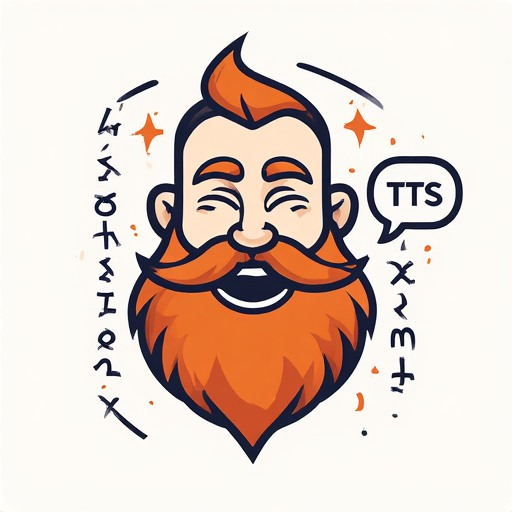

<div align="center">
  
  <h1>⚒️ Khazad Voice TTS</h1>
  <strong>Immersive AI Narrator for The Lord of the Rings Online</strong><br><br>
  
</div>

**Khazad Voice TTS** is an external utility designed to provide real-time narration for *The Lord of the Rings Online* (LOTRO). By combining Optical Character Recognition (OCR) with advanced Text-to-Speech (TTS) models, this tool captures quest text from your screen and narrates it aloud using context-aware AI voices.

<div align="center">
  <table style="border: none;">
    <tr>
      <td align="center" style="border: none;">
        <strong>GPU Model (Outdated vid using LuxTTS)</strong><br>
        <a href="https://www.youtube.com/watch?v=LlAibQ_TlY4">
          
        </a>
      </td>
      <td align="center" style="border: none;">
        <strong>CPU Model (Kokoro82M)</strong><br>
        <a href="https://www.youtube.com/watch?v=aR_5aRTrMQg">
          
        </a>
      </td>
    </tr>
  </table>
</div>

## Table of Contents

* [Key Features](#key-features)
* [Prerequisites](#prerequisites)
* [Installation](#installation)
   * [Windows (One-Click Installer)](#windows-one-click-installer)
   * [Linux (Manual)](#linux-manual)
* [Configuration & Performance Test](#-configuration--performance-test)
* [Calibration (Important)](#calibration-important)
* [Usage & Modes](#usage--modes)
* [🧪 TTS Tester & Custom Voices](#-tts-tester--custom-voices)
* [FAQ & Troubleshooting](#faq--troubleshooting)
* [Credits](#credits)

---

## Key Features

* **Dual AI Engines:**
    * **CPU Mode (Kokoro):** A lightweight, fast inference model compatible with most standard CPUs.
    * **GPU Mode (OmniVoice):** A high-fidelity voice cloning engine for superior audio quality (requires an NVIDIA GPU).
* **Resolution Independent:**
    * Includes a **Calibration Tool** that creates a digital fingerprint of your UI.
    * Works on **1080p, 1440p, 4K**, and Ultrawide monitors.
    * Supports dynamic window resizing (you can widen/shorten the quest window and the bot adapts automatically).
    * Supports static quest window mode (reads from the same part of the screen for higher resolutions / custom skins at the cost of being able to move / resize the quest window)
* **Dual Game Support:**
    * Compatible with **Official Servers (Retail)** via automatic detection.
    * Compatible with **Private Servers (Echoes of Angmar/Classic)** via manual selection.
* **Cross-Platform:**
    * Runs natively on **Windows** and **Linux**.

---

## Prerequisites

### 1. Tesseract OCR
Required for converting screen captures into text.

* **Windows:**
    * **Download:** [UB-Mannheim Tesseract Wiki](https://github.com/UB-Mannheim/tesseract/wiki) (Download the Windows installer).
    * **Installation Path:** The application expects Tesseract to be installed at the default location:
      ```text
      C:\Program Files\Tesseract-OCR\tesseract.exe
      ```
    * **Guide:** [How to install Tesseract on Windows](https://linuxhint.com/install-tesseract-windows/)

* **Linux:**
    * Install via your package manager:
      ```bash
      sudo apt install tesseract-ocr  # Debian/Ubuntu
      sudo dnf install tesseract      # Fedora
      sudo pacman -S tesseract        # Arch
      ```

### 2. getNPCNames Plugin (Retail Mode Only)
Required for Retail mode to identify NPC metadata (Race/Gender) for accurate voice selection.
* **Included:** The plugin is located in the `plugins/Dt192` directory of this repository *(Credit: dt192)*.
* **Installation:** Copy the `Dt192` folder from `plugins/` into your LOTRO Plugins folder.
* **Guide:** [LotroInterface Plugin Installation Guide](https://www.lotrointerface.com/wiki/Install_plugins)

---

## Installation

### Windows (One-Click Installer)

1. Download **`Khazad-Voice-Setup.exe`** from the [latest release](https://github.com/Thelukepet/Khazad-Voice-TTS/releases).
2. Run the installer — it will automatically:
   * Install Python 3.12 (via `uv`).
   * Download all dependencies and voice models.
   * Detect your GPU and install the correct PyTorch drivers.
   * Create desktop shortcuts for launching and configuring.
3. Once complete, the installer will give you new instructions to calibrate the program before your first use (see [Calibration](#calibration-important) below).

That's it! No manual Python or Git installation required.

> **Manual alternative:** If you prefer, clone this repository and run **`Windows/install.bat`**. You will need **Python 3.12** and **Git** installed and on your PATH.

### Linux (Manual)

1.  Clone or download this repository.
2.  Run the installer:
    ```bash
    ./Linux/install.sh
    ```
3.  Follow the on-screen prompts:
    * The script will verify **Python 3.12** and **Git** installation.
    * Select your GPU architecture (CUDA version) when prompted to ensure the correct PyTorch drivers are downloaded.
    * The script will automatically fetch the required voice models.

---

## ⚙️ Configuration & Performance Test

After installation, launch the Configuration Suite to tune the engine for your hardware.

* **Windows:** Run **`Windows/configure.bat`** (or use the desktop shortcut)
* **Linux:** Run **`./Linux/configure.sh`**

### 1. System Configuration
Use this tab to adjust volume, speed, and quality settings.


* **CPU Users (Kokoro):**
    * Stick to the **CPU Mode** panel.
* **GPU Users (OmniVoice):**
    * Use the **GPU Mode** panel.
    * **Diffusion Steps:** Default is `16`. Lower to `8` for speed, raise to `32` for higher audio fidelity.
    * Set **Chunk Size** to `1 (Ultra Fast)` if the speed is still too slow after lowering the Diffusion Steps.
* **Detection:**
    * If you did not install Tesseract in the default `C:/` drive (Windows), enter your custom path here. Linux users generally do not need to change this if installed via package manager.

### 2. Performance Check (OmniVoice)
If you are using the GPU model, switch to the **TTS Tester** tab to verify your system speed.


1.  Select a sample text and click **Generate Preview**.
2.  **Check Speed:** The first generation may take a moment to load the model. Subsequent generations should take **1-3 seconds**.
3.  If generation takes **> 5 seconds**, go back to Configuration and **lower the Diffusion Steps**.

---

## Calibration (Important)

Before running the bot for the first time, you must calibrate it to your screen resolution and UI layout. **This only needs to be done once** (unless you change your UI skin or game resolution).

**Windows users:** The installer's completion screen has calibration buttons built in — you can run calibration directly from there. You can also re-run calibration at any time using the `.bat` files or desktop shortcuts.

### Steps

1. Open LOTRO / Echoes of Angmar and **log in**.
2. **Open any Quest Window** by talking to an NPC. Ensure the window is fully visible on screen.
3. Run the calibration script for your game version:

| Game Version | Windows | Linux |
| :--- | :--- | :--- |
| **Retail LOTRO** | **`Windows/calibrate_lotro.bat`** | **`./Linux/calibrate_lotro.sh`** |
| **Echoes of Angmar** | **`Windows/calibrate_eoa.bat`** | **`./Linux/calibrate_eoa.sh`** |
| **Static Mode** (Fallback) | **`Windows/calibrate_static.bat`** | **`./Linux/calibrate_static.sh`** |

### Retail LOTRO Calibration

Follow the on-screen visual guide. You will be asked to draw boxes around 5 specific anchors:

| Step | Target | Purpose |
| :--- | :--- | :--- |
| **1 & 2** | Left and Right Leaf icons | Finds the Title Bar |
| **3** | Top-Left corner of text body | Anchor point |
| **4** | Intersection of left/right panels | Defines width |
| **5** | Filter icon at the bottom | Defines height |
| **6** | Confirmation box around actual text | Verifies margins |

<details>
<summary>📺 Watch Video Tutorial</summary>

https://www.youtube.com/watch?v=6otQUGYiFx4

</details>

### Echoes of Angmar Calibration

| Step | Target |
| :--- | :--- |
| **1 & 2** | Left and Right Plant icons (Title Bar) |
| **3 & 4** | Top-Left and Bottom-Right corners of the text body |
| **5** | A box around the actual text body (learns margins) |
| **6** | A box around the NPC Name (static position) |

<details>
<summary>📺 Watch Video Tutorial</summary>

https://www.youtube.com/watch?v=hYPYav5oWh8

</details>

### Static Quest Window Mode (Fallback)

Use this if template matching doesn't work on your screen resolution or UI skin. It manually defines a fixed reading zone — the trade-off is that the quest window must NOT be moved after calibration.

1. Open LOTRO with a quest window visible.
2. Run the static calibration script.
3. Draw a single box around the quest text body area (inside the main text area).

The tool will automatically update `config.py` to use static mode with your coordinates.

> **To switch back to auto mode:** Edit `config.py` and change `QUEST_WINDOW_MODE = "static"` to `"auto"`.

---

## Usage & Modes

To launch the application, run the file corresponding to your game version.

### 1. Retail (Live Servers)

* **Windows:** `Windows/start_lotro.bat` (or desktop shortcut)
* **Linux:** `./Linux/start_lotro.sh`

**How it works:**
1. Monitors the game's `Script.log` file to detect when an NPC interaction begins.
2. Uses your **Calibration Data** to instantly locate the quest window.
3. Captures and reads the text automatically.

* **Note:** Because this uses the calibration data, you are free to move and resize the quest window in-game; the bot will adapt dynamically.
* Press **F12** at any time to stop current playback.

### 2. Echoes of Angmar (Classic Mode)

* **Windows:** `Windows/start_eoa.bat` (or desktop shortcut)
* **Linux:** `./Linux/start_eoa.sh`

**How it works:**
1. Open a quest window in-game.
2. Click the **Middle Mouse Button** anywhere on the screen.
3. The tool captures and reads the text based on your calibration and narrates it.

* **Note:** You can freely move the quest window in-game, but the NPC name box (tooltip box) should remain at the same location.
* Press **F12** at any time to stop current playback.

---

## 🧪 TTS Tester & Custom Voices

Want to add a specific voice to the game? The **Configuration Suite** allows you to test audio samples, verify how they sound with the AI, and automatically install them into the correct game folders.

**How to use:**

1.  Run **`Windows/configure.bat`** (or `./Linux/configure.sh`).
    * *Note: This may ask to install FFmpeg via Winget/package manager on the first run.*
2.  Switch to the **TTS Tester & Voice Adder** tab.
3.  **Input Audio:**
    * **Upload:** Drag and drop a `.wav` or `.mp3` file of a voice you want to clone. Should be at least 4 seconds long and ideally around 20 seconds. Longer audio samples will be trimmed to 20s.
    * **Library:** Or select an existing voice from the library to test.
4.  **Test:** Type a sentence and click **Generate** to hear how the AI clones that voice.
5.  **Install:**
    * Select the target **Category** (e.g., dwarf_male).
    * Give the voice a unique name.
    * Click **Save Voice**.
6.  The tool will automatically convert, trim, and place the files. The next time you play, NPCs of that category may randomly use your new voice!

---

## FAQ & Troubleshooting

**Q: The voices are too slow / too silent for me.**

* Run the configuration script and adjust the **Volume** and **TTS Speed** sliders. You can test the changes immediately in the "Tester" tab.

**Q: The bot isn't detecting the quest window in Retail mode.**

* Run the calibration script again. Ensure you draw tight boxes around the requested icons.
* If that does not work consistently, run configuration and lower the **Detection Sensitivity (Threshold)** slider (e.g., to 0.4).
* **Alternative:** Try the **Static Quest Window Mode** (`Windows/calibrate_static.bat` or `./Linux/calibrate_static.sh`) to manually define the quest text area.

**Q: How do I reset the NPC Voice Memory?**

* To wipe the saved voice associations for NPCs (resetting who sounds like what), delete the `npc_memory_retail.json` file from the `data/` folder.

**Q: Can I add my own custom voice references?**

* Yes! Use the **TTS Tester & Voice Adder** in the configuration suite. It handles the file placement and transcription for you.

**Q: I'm a Windows user and installed via the .exe — where are my files?**

* By default the installer places everything in `C:\Khazad-Voice-TTS`. Desktop shortcuts are created for all launchers and the configuration suite.

---

## Future Roadmap

* **Narrator & NPC Voice Splitting**: Intelligent detection to distinguish between spoken dialogue (quoted text) and descriptive text (unquoted).
* ☑️ **Configuration UI & TTS Tester (added in V1.3)**: A user-friendly interface to adjust reading speed, audio quality and testing new Voices
* ☑️ **Windows One-Click Installer (added in V1.4)**: A standalone `.exe` that handles Python, dependencies, and setup automatically
* 🔧(WIP) **Media Hotkeys**: Global shortcuts to stop the current audio or re-play the previous line. --> **`Currently supports F12 key to stop current TTS`**
* **Quest History Plugin**: An in-game LOTRO plugin to display the last ~10 narrated quests.

---

## Credits

* **LOTROToSpeech by ils94:** Inspired by the original [LOTROToSpeech](https://github.com/ils94/LOTROToSpeech) project.
* **Kokoro:** Powered by the [Kokoro-82M](https://huggingface.co/hexgrad/Kokoro-82M) model.
* **OmniVoice:** GPU backend powered by [OmniVoice](https://github.com/k2-fsa/OmniVoice) by k2-fsa — 600+ language zero-shot TTS with voice cloning.
* **Qwen3-TTS:** [Qwen/Qwen3-TTS-12Hz-1.7B-VoiceDesign](https://huggingface.co/Qwen/Qwen3-TTS-12Hz-1.7B-VoiceDesign) model used for creating the .flac reference audio files.
* **XTTS-v2:** [coqui/XTTS-v2](https://huggingface.co/coqui/XTTS-v2) model used to generate the .wav reference audio files using the standard TTS speakers.

## Contributions
* **Linux Port:** Thanks to [Marco Di Fresco](https://github.com/marcodifresco) for porting the application to Linux (Bash scripts and cross-platform compatibility).
